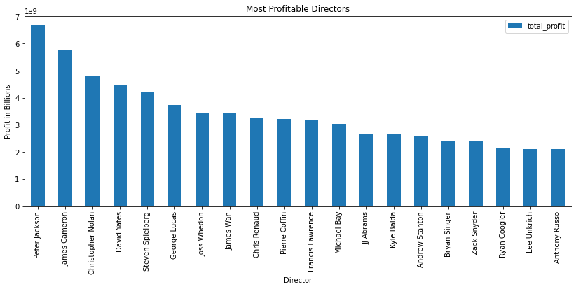
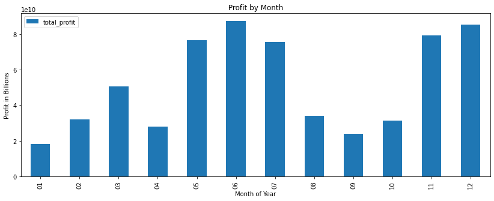
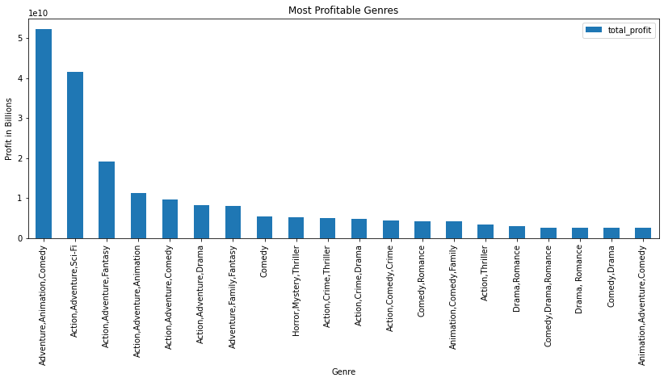

# Microsoft and the Box Office

## Microsoft has tasked me with determining the best options to bring movies to the market.

#### We will look at key questions posed by the business and stakeholders.
##### - What should be our driving factors?
##### - What recipe or recipes will give us success?
##### - Who should we hire to direct our films?
##### - What genres should we make?
##### - What time of year should we release the movies?

## Below is a brief summation of the analysis I performed to answer these questions.

###### The information below was taken from several sources, and used to corroborate my findings.
###### Sources - IMDB.com (https://www.imdb.com/) - A comprehensive list of movies, containing information such as titles, cast, crew, and genre.
######                -Box Office Mojo (https://www.boxofficemojo.com/) - A list of movies containing foreign and domestic gross, and release dates.
######                - The Numbers  (https://www.the-numbers.com/) - Another list of movies containing movie gross, but also containing budget information.

##### I first made sense of the Box Office Mojo information.  Then I cleaned and assembled the information from The Numbers, and checked to see if the movie grosses were close, and to verify that the top movies in one chart were the top movies in another.  I found a few differences, but overall the same movies were in the top of the lists in each of the data sets.  I then created one data set out of the many IMDB datasets.  Then I merged the IMDB data set with the data set from The Numbers, and created a master set with which I could answer the posed questions.  My findings are these:

Here we can see the total profits made by director in the given data sets.  James Cameron, Christopher Nolan, and James Wan dominate this category.

## 
Here we can see which months are the most profitable to release a movie.  As you can see, June, December, and November are at the top of this category.

Here we can see that Animated Adventure Comedies are at the top.

By ascertaining these components, we can now make a decision on what kind of movie to make, who should direct it, and when we should release it.  The ideal movie would be an Animated adventure comedy directed by James Cameron and released in June.  I would also recommend staying with the animated adventure comedy and releasing it in June, but under the direction of either Christopher Nolan or James Wan.

# In closing, I recommend the ideal be sought before compromising.  It is in the stakeholders utmost interest to generate the maximum amount of profits and to be as successful with our first movie as possible for the venture to succeed in the long run.
